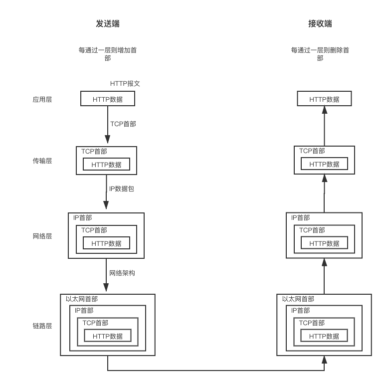

## TCP/IP协议

### 分层管理
应用层、传输层、网络层和数据链路层
- 应用层：决定了向用户提供应用服务时通信的活动。HTTP协议处于该层
- 传输层：对上层应用层，提供处于网络连接中的两台计算机之间的数据传输。两个性质不同的协议:TCP和UDP
- 网络层：处理在网络上流动的数据包。该层规定了通过怎样的路径到达对方计算机，并把数据包传送给对方。
- 链路层：用来处理链接网络的硬件部分。包括控制操作系统、硬件的设备驱动、NIC,及光纤等物理可见部分。

### 通信传输流
发送端在曾与层之间传输数据时，每经过一层时必定会被打上一个该层所属的首部信息。反之，接收端在层与层传输数据时，每经过一层时会把对应的首部去除。

### 确保数据能到达目标
- TCP三次握手策略
  1. 发送端发送一个带SYN标志的数据包给接收端
  2. 接收端收到后，回传一个带有SYN/ACK标志的数据包以示传达确认信息
  3. 发送端再回传一个带ACK标志的数据包，代表“握手”结束